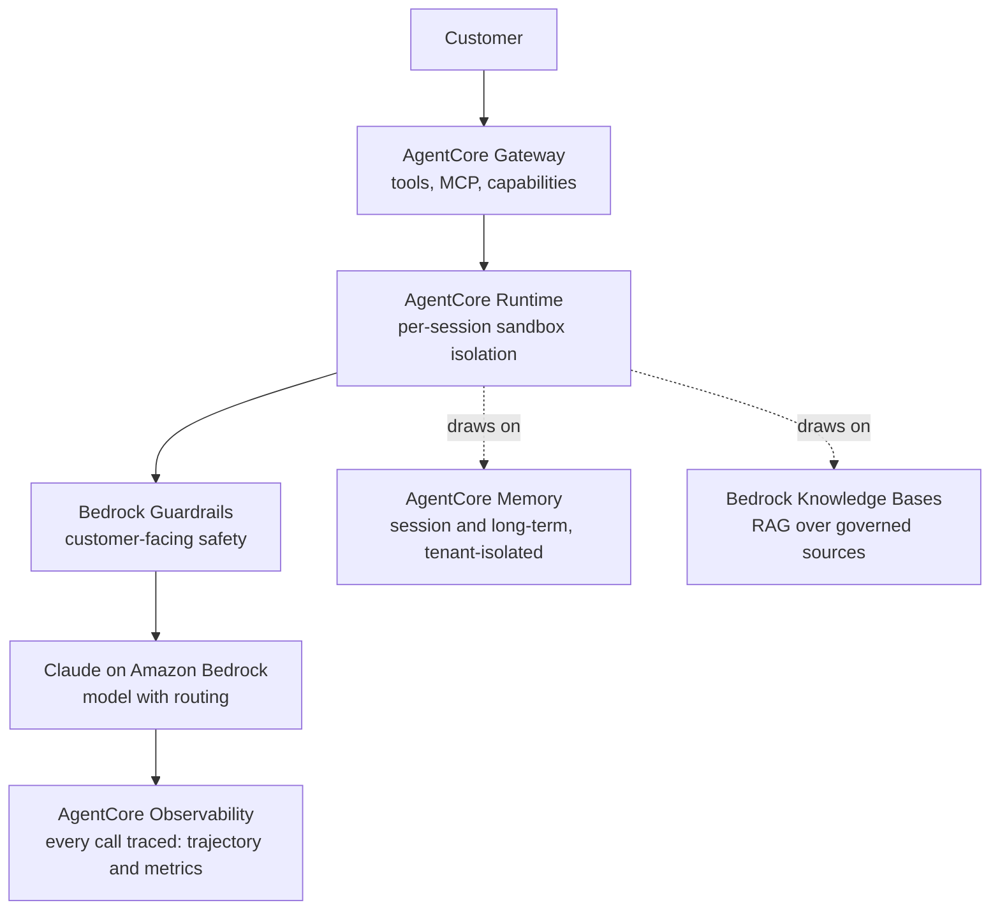
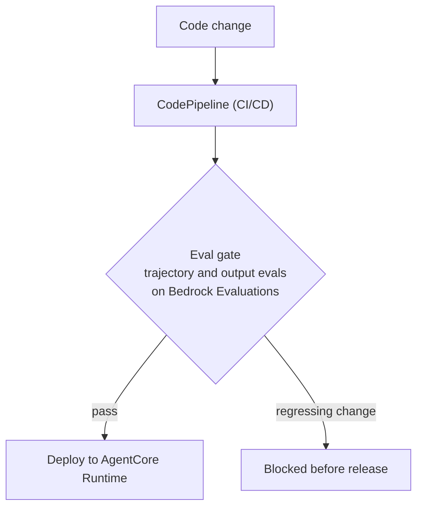
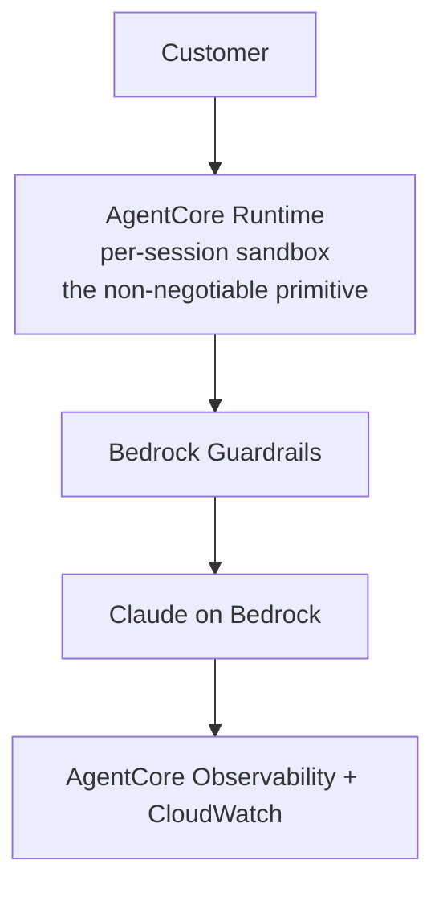
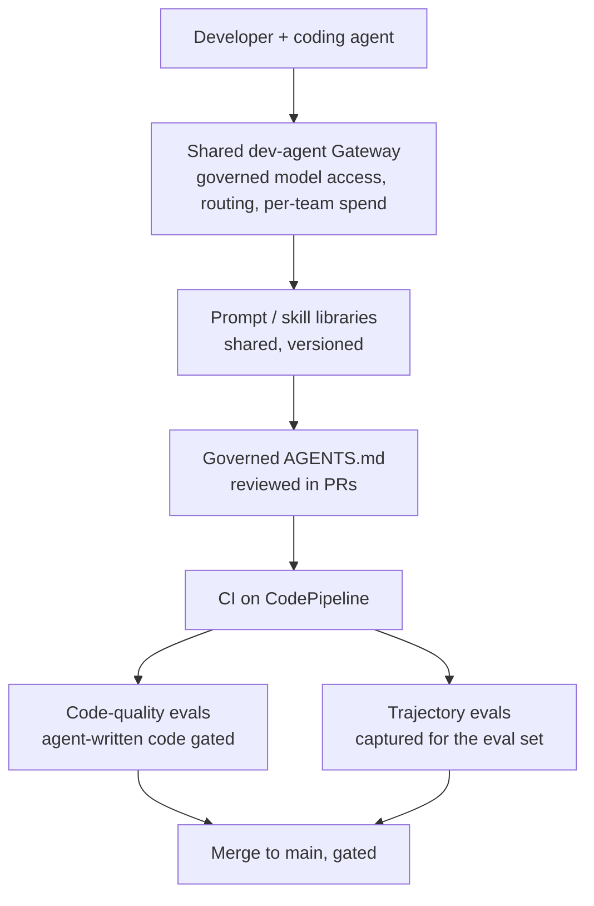

# 03 · Facilitator Field Guide

The in-room reference you score *against*, in workshop order, plus the off-line first-build selection method at the end. This guide consolidates the scoring rubric, the two-track ladder, the Team Topologies read, the managed-vs-open-source guidance, the AWS target architecture patterns, the cost basis, and the first-build selection guide into one document. It carries the definitions, anchors, and how-to-judge text you reference live, and the worked examples (Reimann, Aurum Pay, Brightwell) in full.

Live capture goes in the client's row in the **Agentic SDLC Maturity Engagements** Notion workbook, not into this guide. The session flow and timing are in `02-facilitator-runbook.md`. The report field spec (which deliverable each section feeds, and the generator field map) is in `04-report-outline.md`. The sections below run in the order the runbook proceeds: the seven-primitive scoring rubric, the two-track L0–L3 ladder, the Team Topologies read, managed-vs-open-source, the AWS target architecture patterns, the cost basis, and last (off-line, after the session) the first-build selection method.

---

## 1 · Maturity scoring rubric (seven primitives, 0–5) → D1

The seven platform primitives, each scored **0–5**, with explicit anchors and the evidence to look for. Feeds **D1 · Maturity scorecard**.

> **0 = absent. 5 = a governed, shared capability.** A 5 is not "we use it". It's "it's owned, shared across teams, governed, and you'd notice if it broke."

### How build vs run scoring works

Every primitive is scored **once on the BUILD track** (serving engineers shipping product) and **once on the RUN track** (serving agents shipped to customers). They routinely differ, often by 1–2 points:

- The same gateway can be a governed shared capability for dev agents (build 3+) yet absent for production features that call models directly (run 1).
- Evals can be wired into CI for code quality (build 2.5) yet manual-before-release for customer-facing agents (run 1.5).

In the report's scorecard, a single 0–5 figure per primitive is shown; the prose splits it along the build/run line ("strong on the build side… weak on the run side"). Record both internally; surface the binding (usually lower, run-track) number with the split explained. **Never average build and run into one number.** That erases the finding.

When probing, demand mechanical evidence. "We're careful" is not a control. Ask *how* it is enforced.

### Primitive 1 · LLM gateway

| Score | Anchor |
| --- | --- |
| 0 | No central access. Per-app keys, direct SDK calls everywhere. |
| 1 | One team has a shared key/proxy informally; no governance. |
| 2 | A gateway exists for some use, but not standard; partial logging. |
| 3 | A central gateway for one track (e.g. dev agents): routing, rate limits, cost attribution, logging. |
| 4 | Gateway is standard across teams on one track and emerging on the other; model add is governed. |
| 5 | Single governed gateway for both build and run: routing, quotas, cost attribution, audit, model lifecycle. |

**Evidence:** a real gateway endpoint; routing config; per-team cost reports; an answer to "who can add a model, and how." *On run:* do production features go through it, or call models directly?

### Primitive 2 · Agentic memory

| Score | Anchor |
| --- | --- |
| 0 | No memory; stateless calls only. |
| 1 | Ad hoc, hand-rolled per app; no pattern. |
| 2 | A couple of apps reuse a memory approach informally. |
| 3 | A shared memory pattern documented and used on one track. |
| 4 | Shared, governed memory layer with tenant/user isolation on one track, emerging on the other. |
| 5 | Governed shared memory (e.g. AgentCore Memory) across both tracks, isolated, observable. |

**Evidence:** where session/long-term state lives; whether it's the same layer across features; *on run*, how per-tenant isolation is enforced.

### Primitive 3 · RAG / knowledge

| Score | Anchor |
| --- | --- |
| 0 | No retrieval. |
| 1 | One bespoke RAG pipeline, hand-built. |
| 2 | A couple of pilots, each its own stack. |
| 3 | A sanctioned shared path (e.g. Bedrock Knowledge Bases) used on one track. |
| 4 | Standardised retrieval on one track with access control and quality checks; emerging on the other. |
| 5 | Governed shared knowledge capability across both tracks: access-controlled sources, freshness, retrieval evals. |

**Evidence:** number of independent RAG pipelines (many = consolidation finding); vector store choice; *on run*, source-doc access control and tenant partitioning.

### Primitive 4 · Sandbox / per-session isolation

*The production-readiness primitive. The line between a demo and a product. Probe hardest here on run.*

| Score | Anchor |
| --- | --- |
| 0 | Agent tool/code execution runs full-trust, no isolation. |
| 1 | Some informal caution; no enforced isolation. Customer inputs hit tools without a sandbox. |
| 2 | Isolation for some cases, inconsistent; not per-session. |
| 3 | Per-session isolation on one track, mechanically enforced; tool access allow-listed. |
| 4 | Per-session sandbox standard on one track, emerging on the other; threat-modelled. |
| 5 | Governed per-session sandbox isolation (e.g. AgentCore Runtime) across both tracks; least-privilege tools; audited. |

**Evidence:** *how* isolation is enforced (not "we're careful"); whether one tenant's session can affect another's; tool allow-lists; a threat model and its owner.

### Primitive 5 · Identity & access

| Score | Anchor |
| --- | --- |
| 0 | Agents use broad shared credentials or a developer's identity. |
| 1 | Shared service role, broad access, no per-agent identity. |
| 2 | Some scoping, inconsistent; weak audit. |
| 3 | Per-agent identity with least-privilege on one track; auditable. |
| 4 | Per-agent identity + modelled user-delegation (e.g. AgentCore Identity) on one track, emerging on other. |
| 5 | Governed identity across both tracks: per-agent identity, least-privilege, delegation, full audit ("which agent, on whose behalf"). |

**Evidence:** can logs answer "which agent did this, on whose behalf?"; least-privilege IAM; how on-behalf-of delegation is modelled.

### Primitive 6 · Observability

| Score | Anchor |
| --- | --- |
| 0 | No visibility beyond crash logs. |
| 1 | Basic logging, no trajectory view. |
| 2 | Some tracing per tool, inconsistent. |
| 3 | Full trajectory tracing on one track; some metrics. |
| 4 | Shared observability (traces, trajectories, quality/cost/latency metrics) on one track, emerging on other. |
| 5 | Governed observability (e.g. AgentCore Observability + CloudWatch) across both tracks; fast root-cause. |

**Evidence:** can you trace a full production trajectory end to end; metrics on quality/cost/latency/failure; time-to-find-what-happened when a customer reports a bad response (a number).

### Primitive 7 · Evals

| Score | Anchor |
| --- | --- |
| 0 | No evaluation; vibes only. |
| 1 | Manual review before release. |
| 2 | Some eval sets; advisory, not gating; per-team. |
| 3 | Output evals wired into CI on one track. |
| 4 | Trajectory + output evals on one track, some as gates; emerging on other. |
| 5 | Governed eval capability (e.g. Bedrock Evaluations) across both tracks; trajectory + output evals as **hard release gates**. |

**Evidence:** trajectory evals as well as output evals; whether any eval is a *hard gate* in CI/CD vs advisory; whether a regressing change has ever reached production and how it was caught.

### Worked example · Reimann Software GmbH (illustrative)

Scores as shown in the example report (single figure per primitive, build/run split in prose):

| Primitive | Score | Build/run note |
| --- | --- | --- |
| LLM gateway | 3.0 | Strong on build (central gateway for dev agents); production calls direct. |
| RAG / knowledge | 3.0 | A couple of Bedrock Knowledge Base pilots; build-led. |
| Evals | 2.5 | Code-quality evals wiring into CI (build); manual before release (run). |
| Observability | 2.5 | Production observability trails dev tracing. |
| Agentic memory | 2.0 | Per-app and ad hoc. |
| Identity & access | 2.0 | Per-app and ad hoc for agents. |
| **Sandbox / isolation** | **1.5** | The standout gap. The real production-readiness gap; first thing the build fixes. |

#### The read (as written in the report's scorecard prose)

The scores split cleanly along the build and run line: what serves building scores highest, what production agents need scores lowest. The report writes the scorecard up in three bolded paragraphs, and this is the level of prose D1 should reach.

- **Strong on the build side.** LLM gateway (3.0), RAG / knowledge (3.0) and evals (2.5) are the highest scores, because they grew up serving engineers: a central gateway for dev agents, a couple of Bedrock Knowledge Base pilots, and code-quality evals wiring into CI. These are real, governed-for-build capabilities, which is why they sit at 3.0, not higher (governed on one track, not both).
- **Weak on the run side.** Agentic memory (2.0) and identity for agents (2.0) are per-app and ad hoc: each feature hand-rolls its own. Production observability (2.5) trails dev tracing. Each is a primitive that customer-facing agents need and that building *with* agents can do without, which is exactly why the run track lags.
- **The standout gap: sandbox / per-session isolation (1.5).** This is the real production-readiness gap. Running other people's inputs through an agent with tools, without per-session isolation, is the line between a demo and a product. It is the first thing the recommended build fixes.

Reading: the highest scores grew up serving engineers; the lowest are exactly what production agents need. That split is what places the client at **Build L2, Run L1** (section 2), and it is why the finding is a platform problem, not a model problem. Note that no primitive reaches 3.0 on the *run* track at all: the strongest scores are build-track strengths the prose attributes to building, not running.

---

## 2 · Two-track ladder placement (L0–L3) → D2

Where the client sits from **L0 to L3** on two separate tracks, *building with agents* and *running agentic systems*, placed independently and **never averaged**. Feeds **D2 · Two-track ladder placement**.

> The differentiator is not whether you use AI. It is how much structure, verification, and human judgment surround the output. We score that on two tracks, and the distance between them is the headline.

- **Building with agents:** engineers shipping product *with* agents.
- **Running agentic systems:** agents shipped *to* customers, in production.

### The ladder

| Level | Building with agents *(engineers shipping product)* | Running agentic systems *(agents shipped to customers)* |
| --- | --- | --- |
| **L3** · *Agentic factory* | Self-serve internal platform. Golden paths. The harness (rules, tools, evals) governed as a shared, versioned asset. Model routing. | Self-serve production agent platform. Identity and governance. **Evals as hard release gates.** Stream-aligned teams ship customer-facing agents without rebuilding the plumbing. |
| **L2** · *Platform emerging* | Central gateway for dev agents. Shared skill and prompt libraries. Code-quality evals wired into CI. An enabling / platform team forming. | Shared production primitives: memory, RAG, identity, observability. Trajectory and output evals run as release gates. A platform team forming. |
| **L1** · *Team* | Shared prompts and tools. An `AGENTS.md` in the repo, reviewed in PRs. Manual review of agent-written code. Still siloed. | One or two agentic features in production on hand-built plumbing. Manual eval before release. Basic logging, no shared substrate. |
| **L0** · *Me & Claude* | Individuals on copilots, ad hoc. No shared tooling, no evals, no governance. | Throwaway agent demos and scripts. No deployment, no eval harness, no observability. |

The two tracks look alike at L0 and split apart by L3: running agents in production adds primitives that building with agents does not need, namely per-session sandbox isolation, customer-facing guardrails, identity, and agent-to-agent (A2A) composition.

### How to place a client

1. **Score the seven primitives first** (section 1), build and run separately. The scores point at the rung.
2. **Read each track's level descriptor aloud** and let the client self-locate, then challenge against evidence.
3. **Place the build track**, then **place the run track**, independently.
4. **A track sits at the highest level whose descriptor it fully meets.** If it half-meets the next rung, it has not reached it. Err down on the run track; clients over-rate it.
5. **State the gap** in one sentence: "You build with agents at Lx; you run them at Ly."

### The rules

- **Never average.** "Build L2 / Run L1" is not "L1.5". Two numbers, always. Averaging erases the finding.
- **The gap is the finding.** The distance between the tracks is the spine of the report. A wide gap (build ahead of run) means a *platform problem, not a model problem*, and that is exactly what the recommended first build closes. A narrow gap low down means start at the foundation; a narrow gap high up means the org is genuinely mature.
- **Build usually leads run.** It is far easier to build *with* agents than to run them safely for customers. Expect build ≥ run. If a client claims run > build, probe hard.

### The AWS substrate beneath L2–L3

The rungs above L1 run on a shared platform: **Amazon Bedrock and AgentCore** (Gateway, Memory, Runtime, Identity, Observability), plus **Bedrock Knowledge Bases, Guardrails, and Evaluations.** It is a **substrate beneath the rungs, not a level on the ladder.** Don't place a client at L2 *because* they could adopt AgentCore. Place them by what they have, and let the target architecture (section 5) show how the substrate carries them up.

### Worked example · Reimann Software GmbH (illustrative)

- **Build: L2 (Platform emerging).** Central gateway for dev agents, shared prompt and skill libraries, code-quality evals wiring into CI, an informal AI guild. The build track fully meets the L2 descriptor (a platform emerging, an enabling function forming) but not L3: nothing is yet a self-serve internal platform with golden paths governed as a shared, versioned asset.
- **Run: L1 (Team).** One or two agentic features live in production, each on its own hand-built plumbing, manual eval before release, basic logging and no shared substrate. It is held *down* at L1, not lifted to L2, because there are no shared production primitives (memory, RAG, identity, observability) and no eval gates: the L2 run descriptor is not met. Per the rule "err down on the run track", the half-met rung is not awarded.
- **The gap (the finding):** their ability to ship agents to customers lags their ability to build with them. The distance between the two tracks is the headline, and the report makes it the spine of the whole document.

#### How the report frames the gap (the level of prose D2 should reach)

The executive summary states it in four words: *you build with agents well; you run them in production immaturely.* It anchors the gap in the triggering story: a product owner stood up a working-looking configurator assistant with Claude in days; the last 20 percent (the integration, the edge cases, multi-tenant isolation, correctness, and customer-facing guardrails) is where it got hard. That last 20 percent is not a model problem. It is a platform problem, and the missing layer is the shared production substrate the run track lacks. Closing the gap is therefore what the recommended first build delivers: it lifts the run track from L1 toward L2 and gives the guild a platform to enable onto, instead of a vacuum.

> The substrate beneath L2–L3 (Bedrock + AgentCore + Knowledge Bases + Guardrails + Evaluations) is what the run track is missing here. It is the substrate beneath the rungs, not a rung. The target architecture (section 5) shows how adopting it carries Reimann from Run L1 toward L2.

---

## 3 · Team Topologies read → D3 / D5

Read the client's organisation through Team Topologies. Maturity is not only technical: a shared platform with no team to own it will not hold. The run-track gap is usually also an org gap. The current-state read feeds **D3 · Team & process read**; the target side feeds **D5 · Target operating model**.

> Three team types: a **platform team** owns the substrate, an **enabling team** raises practice, and **stream-aligned teams** ship features.

### Current state (D3): the three team types

For each team type, judge **Have / Partial / Gap** and write a one-line finding from the evidence. The three team types and what to judge each on:

- **Stream-aligned teams** *(ship product)*: How many ship product? How many build agentic features? Each on its own plumbing?
- **Platform team** *(agent substrate)*: Does anyone own a shared **agent** platform, not just cloud/infra? If not, this is the missing layer.
- **Enabling team** *(raises practice)*: Is there an AI guild / enabling function? What does it share, and onto **what**?

Live capture goes in the client's row in the Agentic SDLC Maturity Engagements Notion workbook.

#### Probes for the current-state read

The org-chart answer and the real answer rarely match. Push past the first response to who *actually* owns the substrate, what the guild *actually* enables, and where teams *actually* rebuild plumbing. Probe each team type:

**Platform team (who actually owns the agent substrate)**
- Is there a team whose remit is the shared *agent* substrate (gateway, memory, identity, isolation, evals), or only cloud and infrastructure? Read the remit, do not take the title.
- When a stream-aligned team needs an agent primitive, who do they ask, and does that person consider it their job? "It falls to whoever built it last" is a gap dressed as ownership.
- Is the substrate funded and staffed, or is it someone's side-of-desk? An unfunded owner is not an owner.

**Enabling team / guild (how it operates and what it enables onto)**
- Is there an AI guild or enabling function? How does it operate: standing membership and time, or volunteers between deadlines? Does it meet, review, or just share a channel?
- What does it actually produce that a team can pick up: a prompt or skill library, patterns, reviews, golden paths? Name the artifact.
- And the structural question: does it enable teams *onto* a shared platform, or onto a vacuum? If the practice it spreads has no substrate to land on, that is the failure mode below.

**Stream-aligned teams (where they rebuild plumbing per feature)**
- For the last two agentic features shipped, did the team build its own memory, identity, isolation, or retrieval, or use a shared one? Walk one feature.
- If two teams each shipped an agentic feature, did they build the same plumbing twice? Where is the duplication?
- When a feature needs a primitive that does not exist as a shared service, what happens: it gets hand-rolled, or the feature stalls?

#### Evidence-forcing prompts

Make every status concrete. A "Gap" or "Partial" is only useful in the notes if it names a thing.

- **Name the team.** Which named team or person owns the agent substrate today? If the answer is "no one" or "it depends", write that down verbatim: it is the finding.
- **Name the last feature that rebuilt plumbing.** Which specific feature most recently hand-rolled memory, identity, or isolation that should have been shared? Name it and what it rebuilt.
- **Who would you page?** If a shared agent primitive broke in production right now, who gets paged? If no one, or "the team that built that feature", the substrate has no owner.
- **What does the guild hand over?** Name one artifact a stream-aligned team has actually adopted from the guild in the last quarter. If none, the guild enables onto a vacuum.

#### The two patterns to surface

- **"Enabling onto a vacuum."** A guild spreads prompts and tools but there is no shared platform to enable *onto*. Practice has nowhere to land.
- **"Plumbing rebuilt per feature."** Stream-aligned teams reinvent memory, identity, and isolation for every agentic feature, because there is no shared substrate.

If you hear either, write it down verbatim. They name the most common failure pattern and they motivate the operating-model fix.

### Target operating model (D5)

The fix is structural. For each team type, state what it **owns** and **what changes** for it. The owns column is fixed below; what-changes is captured per client (live capture goes in the client's row in the Agentic SDLC Maturity Engagements Notion workbook).

- **Platform team** (new / from cloud platform team) **owns** the agent substrate: AgentCore Gateway, Runtime, Memory, Identity, Observability, the eval gate, and golden paths.
- **Enabling team** (formalise the guild) **owns** practice: prompt and skill libraries, patterns, reviews, raising the bar across teams.
- **Stream-aligned teams** (the existing ~N) **own** customer-facing agentic features, shipped on the golden paths the platform team provides.

**The target in one line:** stream-aligned teams ship agentic features on golden paths a platform team owns, with an enabling team raising everyone's practice. That is L3 on both tracks, and the operating model is how you get there.

> We design the operating model; the client staffs it. Say so explicitly.

### Worked example · Reimann Software GmbH (illustrative)

#### Current state (D3)

| Team type | Status | Finding |
| --- | --- | --- |
| Stream-aligned teams | **Have** | About 30 teams ship product. Around 5 have started building agentic features, each on its own plumbing. |
| Platform team (agent substrate) | **Gap** | A cloud and infrastructure platform team exists, but no one owns a shared **agent** platform. This is the missing layer. |
| Enabling team | **Partial** | An informal AI guild spreads prompts and tools, but it enables onto nothing shared. |

**Where the gaps are:** the guild is *enabling onto a vacuum*, and stream-aligned teams *reinvent the run-time plumbing per feature*. The fix is structural: stand up a platform team to own the agent substrate, formalise the guild as an enabling team, and give stream-aligned teams golden paths to ship on.

#### Target (D5)

| Team | Owns | What changes |
| --- | --- | --- |
| Platform team (new) | The agent substrate + eval gate + golden paths. | Stand it up from the cloud platform team plus AgentCore. It runs the shared platform so feature teams do not have to. |
| Enabling team (formalise the guild) | Practice: libraries, patterns, reviews. | The AI guild becomes a real enabling team that enables teams onto the platform, not onto a vacuum. |
| Stream-aligned teams (~30) | Customer-facing agentic features on golden paths. | They stop rebuilding memory, identity and isolation per feature and ship on shared primitives. |

---

## 4 · Managed vs open source → D6

A per-capability decision: AWS-managed (Bedrock / AgentCore) or open source. Feeds **D6 · Managed versus open source**.

> **The rule of thumb:** managed by default. Open source earns its place only where a concrete requirement (portability, a bespoke metric, a cost cliff) pays for the extra run cost and operational load you take on.

We are AWS-primary. At most clients' stage, managed services win on most of these. Self-hosting is a deliberate, paid-for choice, not a default.

> **Living reference.** The full capability map, from open source to AWS-native, is kept current at <https://superluminar.io/agentic-stack/>. Use it alongside this section.

### The capability map (managed and open-source options)

For each capability, the managed option and the open-source alternative. Default the recommendation to managed; switch to OSS only with a named, concrete requirement.

| Capability | Managed option | Open-source option |
| --- | --- | --- |
| **Agent gateway** | AgentCore Gateway | Self-hosted MCP gateway |
| **Agent memory** | AgentCore Memory | OSS memory store |
| **RAG** | Bedrock Knowledge Bases | Custom pipeline (LangChain/LlamaIndex + own store) |
| **Evals** | Bedrock Evaluations | OSS eval frameworks / custom sets |
| **Vector store** | S3 Vectors (low volume) / OpenSearch Serverless (at scale) | Self-hosted (e.g. pgvector, Qdrant, OpenSearch) |
| **Identity** | AgentCore Identity + IAM | Self-managed identity broker |
| **Observability** | AgentCore Observability + CloudWatch | OSS tracing (OpenTelemetry stack) |
| **Sandbox / runtime** | AgentCore Runtime (per-session sandbox) | Self-hosted isolation (containers/microVMs) |

The per-capability recommendation and reason are captured per client. Live capture goes in the client's row in the Agentic SDLC Maturity Engagements Notion workbook.

### When open source actually earns its place

Switch a row to OSS only when one of these is concretely true and you can name it:

- **Portability.** A hard requirement to avoid lock-in or run across clouds/on-prem (e.g. agent memory that must be portable). Until that requirement is real, it's hypothetical cost.
- **A bespoke metric or behaviour.** A domain-specific eval the managed service can't express: keep the managed core, add OSS for the few bespoke metrics.
- **A cost cliff.** A volume where the managed price genuinely overtakes the operational cost of self-hosting (often the vector-store decision at scale). Do not reach for the most expensive option by default; do not self-host prematurely either.

If none of these is named, the answer is managed.

### Worked example · Reimann Software GmbH (illustrative)

| Capability | Recommended | Why |
| --- | --- | --- |
| Agent gateway | **AgentCore Gateway (managed)** | Self-hosting an MCP gateway adds run cost without payback at this stage. |
| Agent memory | **AgentCore Memory (managed)** | Open source only if a hard portability requirement appears. |
| RAG | **Bedrock Knowledge Bases (managed)** | Standardise the pilots onto one managed path. |
| Evals | **Bedrock Evaluations + custom eval sets** | Managed core, with open source for a few bespoke domain metrics. |
| Vector store | **S3 Vectors (low volume), OpenSearch Serverless (at scale)** | Same sizing logic as the readiness report: do not reach for the most expensive option by default. |
| Identity | **AgentCore Identity + IAM** | Per-agent identity and least-privilege as managed building blocks. |
| Observability | **AgentCore Observability + CloudWatch** | One observable substrate beats per-feature tracing. |
| Sandbox / runtime | **AgentCore Runtime (per-session sandbox)** | Managed per-session isolation is the shortest path to closing the production-readiness gap. |

**Reading:** at this stage managed wins on every row; the only flagged future exits to OSS are a hard portability requirement (memory) and a few bespoke eval metrics. That is the rule of thumb in practice.

---

## 5 · AWS target architecture patterns → D4 (and D8)

This section holds **two co-equal targets**, one per track. The **run-track product platform** below is the destination for a run-primary client (agents shipped to customers); the **build-with-agents target** further down is the destination for a build-primary one (engineering adopting agentic coding). Design toward whichever the client's weaker track needs; a client carrying both gets both. We **design** the architecture per selected build from the gathered signals, so the patterns here are a rough guide, not a menu to pick from.

The run-track reference target: a **production agent platform on Amazon Bedrock AgentCore**. One shared platform that run-track teams ship onto. Stream-aligned teams ship features onto it; they do not rebuild the plumbing each time. Everything stays in **`eu-central-1` (Frankfurt)**. Feeds **D4 · AWS-native target architecture** (and supports **D8**).

> Managed AgentCore, not hand-built. The client already runs the plumbing by hand, per team. AgentCore gives gateway, runtime isolation, memory, identity and observability as managed building blocks, so the platform team owns golden paths instead of maintaining infrastructure. That is the shortest path from L1 to L2 on the run track.

### The reference target

#### The request path (RUN)

A customer uses an agentic feature. The request flows:

- **AgentCore Gateway** is the governed entry to tools.
- **AgentCore Runtime** runs each session in an isolated sandbox: the primitive that separates a demo from a product.
- **AgentCore Memory** + **Bedrock Knowledge Bases** supply state and retrieval, tenant-isolated. The agent reaches for retrieval on demand through the Gateway as a tool: query structured or live data directly at its source, and use the vector store for large unstructured corpora rather than as the default move.
- **Bedrock Guardrails** bound customer-facing behaviour.
- **Claude on Bedrock** is the model, with routing (cheaper models for simpler tasks).
- **AgentCore Observability** traces every call, trajectory and metric.

#### The build / ship path (BUILD)

Teams ship changes through CI/CD with an eval gate that blocks regressions *before* release:

Supporting, across both paths:

- **AgentCore Identity** gives each agent its own identity (and models on-behalf-of-user delegation).
- **IAM** stays least-privilege.
- **CloudWatch** backs observability.

### Data flow, in words

A customer request enters through the Gateway, runs in an isolated Runtime sandbox, draws on Memory and Knowledge Bases, is bounded by Guardrails, is answered by Claude on Bedrock with routing, and is traced end to end in Observability. Changes to any agent reach production only through CodePipeline, past a trajectory-and-output eval gate on Bedrock Evaluations. Each agent carries its own identity; IAM is least-privilege; CloudWatch underpins the traces.

### EU residency & sovereignty

- All components deployed in **`eu-central-1` (Frankfurt)**. Data (prompts, memory, knowledge, traces) stays in the EU.
- Maps to **GDPR** and **EU AI Act** obligations: governed identity and audit (who did what, on whose behalf), Guardrails for customer-facing safety, and traceability for accountability.
- **Derive the sovereignty bar from the client's actual compliance obligations** (regulation, contract, certification, data classification), not from "we want the most sovereign option". In the current EU mood that ask is reflexive; map what genuinely binds them, and where over-specifying would cost services and capability for no required benefit, say so.
- Where a sovereignty constraint is genuinely harder (public-sector, regulated, defence), do not assume the **AWS European Sovereign Cloud** clears it. ESC raises the bar but is more limited in services and is not a drop-in, and for the strictest cases an EU-native provider (Scaleway, STACKIT) may be required and score higher on sovereignty than a US-owned hyperscaler's sovereign offering. Note too that an AgentCore-style managed agent stack may not exist on the chosen sovereign platform, so the target itself may change. Assess the actual bar and confirm the residency line with the client's data-protection contact before finalising the target.

### Smaller variant (for teams earlier on the ladder)

For a client at **Run L0/L1** who is not ready for the full platform, descope to the minimum that still closes the production-readiness gap:

Add a single **output eval check** in CI (CodePipeline) rather than the full trajectory + output gate. Defer Gateway, Memory, Knowledge Bases, and full Identity to a later phase as features and traffic justify them. **Keep per-session isolation, basic guardrails, and observability even in the smallest variant.** Those are what make it a product rather than a demo. Grow into the full reference target along the roadmap (`02-facilitator-runbook.md`, D7).

### Build-with-agents target (the internal agentic-coding platform)

The reference target above is a **run-track product platform**: the substrate for agents shipped to customers. A **build-primary** client is moving toward a different target, and the guide owes that target the same depth. This is the internal agentic-coding platform: the thing a build-weak client builds *with*, so engineering adopts agents as a shared, governed, gated capability rather than forty teams each inventing it. It is the target candidate **D** (internal golden path) is a scoped slice of, and the destination the build-track first builds design toward. Feeds **D4** for a build-primary engagement, the same way the run-track target feeds it for a run-primary one.

> This is a target, not a precursor. A build-primary client (no agent product, none planned, such as Aurum Pay in section 7) designs toward this and stops here. There is no implied run-track platform waiting behind it. Where a client carries both tracks, both targets are designed; they share the gateway, identity, observability and eval substrate underneath but serve different consumers (developers versus customers).

#### The build / ship path, internally

A developer builds with a coding agent. The path:

Supporting, across the platform:

- **AgentCore Identity** (or the dev-tooling equivalent) gives the dev agent an identity distinct from the developer's, so an agent's commit, PR, or internal-API call is distinguishable from a human's in the audit trail. This is what a PCI- or audit-scope codebase needs from the build path.
- **Tool allow-lists** bound what a coding agent may execute on a developer machine or in CI, against poisoned input from an issue, a repo, or a web page.
- **AgentCore Observability** + **CloudWatch** give a lead a view of how agentic coding is actually used across teams (adoption, where it helps, where it stalls), not just the individual engineer's IDE view.
- An **enabling team** (the community of practice formalised) owns the golden path and spreads it, rather than swapping prompts in a Slack channel and enabling onto a vacuum.

#### AWS-primary, with the OSS equivalent

AWS-primary is **Amazon Bedrock for the governed model access plus the AWS dev tooling**: Bedrock (with Claude) behind the shared gateway, CodePipeline for the CI gate, AgentCore Identity and Observability for attribution and the cross-team view, Bedrock Evaluations for the code-quality and trajectory evals. The `AGENTS.md`, prompt and skill libraries are repo artefacts, governed in version control, cloud-agnostic by nature.

The **OSS or other-tooling equivalent**, where a client's developer estate is not AWS-centred or wants the gateway under its own control: an OSS model gateway (LiteLLM, or an internal proxy) for routing and spend attribution, the same `AGENTS.md` and skill libraries in git, evals on an OSS harness (promptfoo, or a home-grown runner) wired into whatever CI the client already runs (GitHub Actions, GitLab CI), and OpenTelemetry-based tracing for the trajectory capture. Reach for it where the dev platform must sit close to the existing toolchain or stay portable; take the managed AWS path where the client is already on Bedrock and the operational load of self-hosting the gateway earns nothing.

> The build-track target is lighter to run than the run-track product platform: a dev-agent gateway and CI eval runs, no customer-facing per-session sandbox fleet, no production memory or tenant-isolation surface. Size the run cost accordingly (section 6), and keep the numbers as effort and AWS run cost.

### Per-build feasibility scoping (off-line, when the selected build is an agent platform)

Once the first build is **selected** (section 7), and when that build is an agent platform rather than, say, a thin org-first slice, scope it at depth. This is **off-line synthesis**, not a live exercise: you run it against the settled diagnosis to produce the build's architecture and an honest effort read, not in the room. It is **scoping a POC / first build**, not fixing a product: the output is the architecture you would design and build for *this* selected slice, plus where the effort and risk sit, so the build can be sized (section 6) and written up in full (section 7, D8).

Organise the scoping by the **AgentCore service surface**. Each surface carries a few sharp questions; answer them from the gathered signals, name the **AWS-primary** instantiation, and name the **OSS or other-cloud equivalent** where portability or control earns the operational load. Not every surface is in scope for every build: a smaller variant or a build-track golden path touches only some. Scope the ones the selected build actually needs, and record which you deliberately left out.

> Derive the surfaces in scope from the selected build, not from this list. A run-track platform foundation (candidate A) touches most of them; an isolation-first hardening (B) is mostly Runtime and Guardrails; a build-track golden path (D) is mostly Gateway, Memory-as-`AGENTS.md`, Evals and Observability on the dev path. The list is the rough guide; the build decides.

#### Runtime

- How long does a session run, and what is the concurrency at peak? Is invocation synchronous (a customer waiting) or asynchronous / batch?
- Does each session need its own sandbox isolation, and how hard is the tenant boundary (the run-track non-negotiable), or is this a dev-path build where the isolation question is about what a coding agent may execute locally and in CI?
- **AWS-primary:** AgentCore Runtime (per-session sandbox isolation). **OSS / other:** a self-managed isolation layer (gVisor or Firecracker microVMs, or per-session containers on the client's own orchestration) where the runtime must sit off AWS or under direct control. Take the managed Runtime unless portability genuinely earns the load.

#### Gateway

- How many tools and APIs must the agent reach, and how fast does that set change? Are there MCP servers to front, or to build?
- What is the auth shape, inbound (who may call the gateway) and outbound (how the gateway authenticates to each tool)?
- **AWS-primary:** AgentCore Gateway (governed tool access, MCP, inbound/outbound auth). **OSS / other:** an OSS MCP gateway or model proxy (LiteLLM and an MCP server layer) where the tool estate is not AWS-centred or the gateway must be portable.

#### Memory

- What must persist within a session versus across sessions (long-term)? Who consumes it, and is it tenant-isolated?
- **What must NOT be retained** (personal data, secrets, regulated fields)? Derive the retention boundary from the compliance obligations, not from convenience.
- **AWS-primary:** AgentCore Memory (session + long-term, tenant-isolated). On the build track, "memory" is often the governed **`AGENTS.md`** and shared project context rather than a managed store. **OSS / other:** a self-hosted vector/state store (the client's own Postgres/pgvector or Redis) where memory must stay on a controlled or sovereign platform.

#### Identity

- How do agents authenticate to the systems they use, shared role or per-agent identity? Does an agent act on behalf of a user, and is that delegation modelled?
- Can you answer "which agent did this, on whose behalf?" from the logs the build would produce?
- **AWS-primary:** AgentCore Identity (per-agent identity, on-behalf-of-user delegation), IAM least-privilege. **OSS / other:** an OIDC/OAuth identity provider (Keycloak, or the client's IdP) issuing per-agent identities where identity must live outside AWS or integrate an existing estate.

#### Policy / Guardrails

- What content, PII, topic, and action controls must bound the agent, customer-facing or internal? Derive them from obligations, not from a default.
- Is prompt-injection a live risk (the agent runs other people's inputs through tools)? What stops a poisoned input acting?
- **AWS-primary:** Bedrock Guardrails (content, PII, topic, denied-action filters) plus tool allow-lists. **OSS / other:** an OSS guardrail layer (Llama Guard, NeMo Guardrails, or a policy engine such as OPA for action controls) where guardrails must be self-hosted or customised beyond the managed set.

#### Evals

- Which quality dimensions actually matter for this build (correctness, safety, retrieval quality, code quality on the dev track)? Is there a **golden / eval set**, or must one be built?
- Do you need **trajectory** evals (did the agent take a sensible path) as well as **output** evals? Is the eval a **hard gate** that blocks a release, or **advisory**?
- **AWS-primary:** Bedrock Evaluations (output + trajectory), wired into CodePipeline as a hard gate. **OSS / other:** an OSS eval harness (promptfoo, Ragas for retrieval, a home-grown trajectory runner) on the client's existing CI where evals must be portable or deeply customised.

#### Observability

- What must be visible: full request traces, trajectory capture, dashboards? What is the target time-to-diagnose for a bad agent response (a number from the diagnosis is the bar)?
- On the dev track, can a lead see cross-team adoption and where agentic coding stalls, not just one engineer's IDE view?
- **AWS-primary:** AgentCore Observability + CloudWatch (traces, trajectory, dashboards). **OSS / other:** OpenTelemetry plus an OSS backend (Langfuse, Phoenix, Grafana/Tempo) where observability must aggregate across non-AWS surfaces or stay under the client's control.

#### Multi-agent

- Is this a single agent, a supervisor with sub-agents, or a swarm? Who orchestrates, and how is hand-off and shared state handled?
- Does multi-agent work depend on per-agent identity being in place first (it usually does)? If so, that ordering is part of the effort read.
- **AWS-primary:** AgentCore primitives composed under a supervisor pattern (Bedrock-hosted orchestration, agents carrying their own AgentCore Identity). **OSS / other:** an OSS orchestration framework (LangGraph, CrewAI, or AutoGen) where the orchestration logic must be portable or sit off AWS. Keep multi-agent out of a first build unless the selected build genuinely needs it; a single well-scoped agent is usually the smaller, safer slice.

> The output of this scoping is **the architecture and an effort read for the selected build**, surface by surface, with the AWS path named first and the OSS/other-cloud path noted where it earns its place. It feeds the run cost (section 6) and the full write-up (section 7, D8). Where the sovereignty bar (above) forces an EU-native platform on which a managed AgentCore-style stack does not exist, the surfaces above still frame the scoping, but several "AWS-primary" lines fall away and the self-hosted equivalent becomes the target, not the alternative; the effort read changes accordingly.

### Diagram source note

An **editable draw.io source** for the target architecture ships alongside the report, so the client can adapt it. Keep the `.drawio` file with the report deliverables. The ASCII flows above are the canonical content the diagram renders; mirror them exactly when drawing.

### Worked example · Reimann Software GmbH (illustrative)

The full reference target applies. One shared platform on Amazon Bedrock and Bedrock AgentCore that both tracks run on: stream-aligned teams ship features onto it and do not rebuild the plumbing each time. Everything stays in `eu-central-1` (Frankfurt). The report writes the target up as two paths, and this is the depth D4 should reach.

**The request path (run).** A customer uses an agentic feature. It calls the AgentCore Gateway for tools, runs in the AgentCore Runtime with per-session sandbox isolation, draws on AgentCore Memory and Bedrock Knowledge Bases, and is bounded by Bedrock Guardrails. Claude on Bedrock is the model, with routing (cheaper models for simpler tasks). Every call is traced in AgentCore Observability.

**The build path (ship).** Teams ship through CI/CD (CodePipeline) carrying a trajectory and output eval gate powered by Bedrock Evaluations: a regressing agent change is blocked before release, not after. AgentCore Identity gives each agent its own identity; IAM stays least-privilege; CloudWatch backs observability.

**Why managed AgentCore, not hand-built.** Reimann already runs the plumbing by hand, per team. AgentCore gives gateway, runtime isolation, memory, identity and observability as managed building blocks, so the platform team owns golden paths instead of maintaining infrastructure. That is the shortest path from L1 to L2 on the run track.

**The migration as proof.** The existing configurator assistant migrates onto this shared foundation as the golden-path proof, gaining per-session isolation, shared memory and identity, observability, and the trajectory eval gate in CI. It is the live evidence that the substrate works, and it is what lifts the run track from L1 toward L2 while giving the guild a platform to enable onto, instead of a vacuum. An editable draw.io source for this target ships alongside the report.

---

## 6 · Cost basis → D8 (effort and run cost)

For the recommended first build, the kit produces the **delivery effort** (person-days per workstream) and an **estimate of the monthly AWS run cost**. Feeds **D8 · Recommended first build** and the executive-summary hero stats. Note who owns each number: delivery sizes the effort; the day rate and price are sales'; the run cost is AWS's pricing, which we only estimate.

> The kit does not set a day rate or a price. The rate and the one-off engagement price are owned by sales and are filled in with them when the report is compiled. What delivery brings to that conversation is the effort sizing below and the run-cost estimate. The euro figures in the worked example are reproduced from the published example report to show order of magnitude, not a rate this kit asserts.

Live capture of the per-build numbers goes in the client's row in the Agentic SDLC Maturity Engagements Notion workbook.

### A · Delivery effort (person-days), the line-item basis

Estimate person-days per workstream. Capability transfer is built in: the client's platform and enabling teams upskill alongside ours, so some days are paired, not solo. The workstreams below are the **example A** (platform foundation) shape:

- AgentCore foundation (Gateway, Runtime + per-session sandbox, Memory, Identity)
- Observability + Guardrails wiring
- Eval gate in CI/CD (trajectory + output, on Bedrock Evaluations via CodePipeline)
- Migrate the flagship feature onto the platform (golden-path proof)
- Capability transfer / pairing / handover
- **Total effort**

> This is the *selected* first build's effort. The workstreams above are the example A shape. For a different selected build (B to H in section 7), re-write the workstreams.
>
> Phase 0 only. Migrating every feature, staffing the platform-team org change, and new customer-facing features are out of scope (later phases). See section 5 and the roadmap in `02-facilitator-runbook.md`.

**Turning effort into the report's one-off table.** The generator's one-off delivery table is *Item · Basis · Indicative*. Delivery supplies the Item (workstream) and the Basis (person-days). The Indicative euro figure is the person-days at the rate sales sets, entered when you compile the report with sales. Do not pre-fill a rate.

### B · Estimated monthly AWS run cost, the line-item basis

This is AWS's pricing, not ours. We estimate it from the architecture and the AWS Pricing Calculator so the client can plan; we do not set it, and it moves with usage and AWS's own rates. Estimate monthly operating cost in `eu-central-1`. Sizes scale with traffic, so give a range (low-traffic foundation to early production load). The line items and their cost drivers:

| Line item | Driver |
| --- | --- |
| AgentCore Runtime (per-session sandbox) | sessions / compute-time |
| AgentCore Gateway | tool calls / requests |
| AgentCore Memory | stored sessions / reads |
| Bedrock model tokens (Claude, with routing) | input + output tokens |
| Vector store (S3 Vectors low-volume / OpenSearch Serverless at scale) | vectors stored + queries |
| Observability / CloudWatch | traces + metrics + log volume |
| Bedrock Knowledge Bases (RAG) | indexed docs + queries |
| Guardrails | evaluated requests |
| **Monthly total (range)** | |

> Choose the vector store on volume, not by default: S3 Vectors for low volume, OpenSearch Serverless at scale. Model token cost is usually the largest swing item; routing cheaper models for simple tasks materially lowers it.

### C · Headline figures (for the report hero boxes)

Delivery supplies Effort and Timeline, and estimates the run-cost range from the AWS Pricing Calculator. The Indicative first engagement price is compiled with sales (effort at the agreed rate), so leave it for that step.

| Field | Owner |
| --- | --- |
| Effort | delivery sizes (~__ person-days) |
| Timeline | delivery sizes (__ weeks elapsed) |
| Indicative run cost | AWS pricing, we estimate (~€__ to €__ / mo) |
| Indicative first engagement (price) | sales (filled when compiling the report) |

### Worked example · Reimann Software GmbH (illustrative)

The published example report shows a ~**28 person-day** first build over **6–8 weeks**, with a ~**€600–1,400/mo** run cost. The example PDF also prints a ~€39k engagement price; that price is the published illustration only. In a real engagement the price comes from sales at their rate, not from this kit.

**A · Effort** (28 person-days):

| Workstream | Person-days |
| --- | --- |
| AgentCore foundation (Gateway, Runtime + sandbox, Memory, Identity) | 9 |
| Observability + Guardrails wiring | 4 |
| Eval gate in CI/CD | 5 |
| Migrate configurator assistant (golden-path proof) | 6 |
| Capability transfer / pairing / handover | 4 |
| **Total effort** | **28** |

**B · Run:** indicative ~**€600–1,400/mo** for the foundation plus one live feature, dominated by Bedrock model tokens and AgentCore runtime, with a low-volume vector store (S3 Vectors). Scales with traffic as more features migrate.

**C · Hero boxes:** Effort **~28 person-days**, Timeline **6 to 8 weeks**, Run **~€600 to 1,400/mo**. The engagement price is added with sales.

> Delivery sizes the effort and estimates the AWS run cost (AWS's pricing, not ours). The price is set with sales.

---

## 7 · First-build selection guide (off-line, after the session) → D7 (Phase 0) / D8

**Feeds Deliverable 07 (Phased roadmap, Phase 0) and Deliverable 08 (Recommended first build).**

The recommended first build is **derived from this client's diagnostic**: their scorecard shape, their two-track gap, their team read, and the real pain in their triggering story. It is not a fixed output.

> If the workshop recommends the same build to every client, it isn't a diagnostic. It's a sales pitch for a product we could put on the Marketplace. The whole value is that the first build is the highest-leverage move *for them*. Two clients should routinely leave with different first builds.

The target architecture (section 5) is the destination and the menu. The first build is **one scoped slice of it**: the piece that unblocks the next rung on this client's *weaker* track. Pick one. Make it small. Gate it on evidence.

> **When this happens: off-line, after the diagnosis is finalised.** Selecting the build is the central analytical conclusion of the engagement, so the four reads below run against the *settled* scorecard, placement, and team read, not the provisional pencil from the room. The session gathers the inputs the selection needs (read four, the live pain, and the appetite to fund it); the selection and scoping are made here, in synthesis, and land in the report. Picking the build in the room, before the scores are settled, is the superficial-diagnosis trap: a recommendation the evidence has not yet earned.

### How to select (the decision)

Run these four reads against the diagnostic, in order. The first build is where they converge.

1. **Which track is weaker, and by how much?** The first build moves the *weaker* track up one rung. Build-weak and run-weak clients get very different first builds. The two tracks are co-equal here: a build-weak client lands on a build-track build (typically **D**), and the run track being n/a (no agent product) does not push the recommendation toward a run-track build it has no use for. If only one track is in play, that track is the weaker track by definition, and the build is on it.
2. **What is the single lowest, most-binding primitive?** (section 1 scorecard, on the track in play.) The first build usually fixes the primitive that blocks everything downstream, not the easiest one, the binding one. For a build-primary client that is a build-side primitive (a missing dev-agent gateway, no AGENTS.md, no CI eval gate), read against the build scores.
3. **Is the blocker technical or organisational?** (section 3 team read.) A strong stack no one owns needs a *team-first* build, not more platform. This read is track-neutral: a build-primary client can equally have the org gap (the community of practice enabling onto a vacuum), which folds the enabling-team move into the golden-path build.
4. **What is the client's live pain?** (Block 0 triggering story.) The first build should visibly relieve the thing that brought them into the room, or it won't get funded. For a build-primary client that is the uneven, ungoverned adoption (one team flies, another fights the tooling; a plausible-wrong change in `main`; spend with no attribution), not a production incident.

Then sanity-check the candidate: Is it **one** thing? Is it **scoped** (weeks, not quarters)? Does it have an **observable gate**? Does it leave the client **owning** something reusable? If not, cut it down.

### Candidate first builds (the library)

Each entry: the **diagnostic signature** that points to it, **what it is**, and **what it lifts**. These are starting points; scope the real one to the client.

#### A. Production platform foundation on AgentCore
- **Signature:** Build track ahead of Run (e.g. Build L2 / Run L1); run-side primitives lowest (sandbox/isolation, memory, identity); at least one agentic feature already live on hand-built plumbing to migrate.
- **What it is:** AgentCore Gateway, Runtime with per-session sandbox, Memory, Identity, Observability; Guardrails; a trajectory + output eval gate in CI; the flagship feature migrated as the golden-path proof.
- **Lifts:** Run track L1 → toward L2. *This is the Reimann example in the sample report: common, but not the default.*

#### B. Isolation-first hardening
- **Signature:** Sandbox/isolation is the standout low score **and** customer-facing agents are already running other people's inputs through tools without per-session isolation. Acute production risk, but the rest of the platform is adequate.
- **What it is:** A narrow build: per-session sandboxing and guardrails around the existing feature(s), not a full platform. The line between a demo and a product.
- **Lifts:** Closes the single most dangerous run-track gap fast, before a broader platform investment.

#### C. Eval gate + release governance
- **Signature:** Decent platform primitives but Evals and/or Observability lowest; teams ship agent changes fast and *blind*, regressions caught in production, not before.
- **What it is:** A trajectory + output eval gate on Bedrock Evaluations wired into CI as a hard release gate, plus the observability to back it, proven by blocking one real regressing change.
- **Lifts:** Makes shipping agents safe to repeat; turns "we ship fast" into "we ship fast without breaking customers."

#### D. Internal golden path for building with agents
- **Signature:** *Build* track is the weak one (L0–L1): developers on copilots ad hoc, no shared prompts/tools, no AGENTS.md, no dev-agent gateway, code-quality evals not gating CI. The run track may be genuinely n/a (no customer-facing agent product), which does not weaken the case for this build; for a build-primary client this *is* the engagement, not a precursor to a later run-track one. Internal leverage, consistency, and trust are the whole prize.
- **What it is:** A shared dev-agent gateway, prompt/skill libraries, an AGENTS.md reviewed in PRs, code-quality evals into CI as a gate, tool allow-lists and agent attribution for the dev path, and the guild/community of practice formalised as an enabling team. Scoped to a pilot team first, with the golden path as the reusable proof.
- **Lifts:** Build track L1 → L2. A complete first build in its own right, whether or not a run track ever follows.

#### E. RAG / knowledge productionisation
- **Signature:** RAG/knowledge is the binding primitive for the client's key use case (pilots exist but aren't a governed, shared capability) and that use case is the live pain.
- **What it is:** Bedrock Knowledge Bases standardised onto one managed path (S3 Vectors low-volume, OpenSearch at scale), with the flagship retrieval feature productionised and evaluated.
- **Lifts:** Turns scattered RAG pilots into a shared capability the next use case reuses.

#### F. Platform team + thin platform slice (org-first)
- **Signature:** Technology is not the main gap. The **team read** is: no one owns a shared agent platform, the guild enables onto a vacuum, stream-aligned teams reinvent plumbing per feature.
- **What it is:** Stand up the platform team from the existing cloud/infra team plus a deliberately thin platform slice (one or two primitives) for them to own and prove. Design the operating model; the client staffs it.
- **Lifts:** Gives the substrate a home so any later platform work actually holds.

#### G. Observability / trajectory tracing foundation
- **Signature:** Agents in production but Observability lowest: running blind, no trajectory traces, incidents are guesswork.
- **What it is:** AgentCore Observability + CloudWatch tracing across the live agent(s), with trajectory capture that later feeds the eval sets.
- **Lifts:** Makes the run track legible: the precondition for governing it.

#### H. Agent identity & access
- **Signature:** Multiple agents sharing credentials / no per-agent identity, and governance or audit pressure is real.
- **What it is:** AgentCore Identity giving each agent its own identity, IAM least-privilege, auditable access.
- **Lifts:** Closes the identity gap that blocks safe multi-agent and A2A work.

> The list is not exhaustive. A real first build is often a **named composite** of a primary (e.g. A) with one secondary element folded in (e.g. B's isolation), but still one scoped, gated build, not a wish list.

### Selection matrix (quick reference)

| If the diagnostic shows… | Lean toward |
| --- | --- |
| Run << Build, run primitives broadly thin, a feature to migrate | **A** Platform foundation |
| Sandbox/isolation the one acute gap, customers already exposed | **B** Isolation-first |
| Strong primitives, evals/observability the gap, shipping blind | **C** Eval gate + governance |
| Build track itself weak; internal dev leverage missing | **D** Internal golden path |
| RAG the binding primitive for the live use case | **E** RAG productionisation |
| Tech adequate, *no one owns* the platform (org gap) | **F** Platform team + thin slice |
| In prod but flying blind | **G** Observability foundation |
| Shared creds / governance pressure on identity | **H** Agent identity |

Use it as a prompt, not a lookup table. Real clients combine signatures; the four reads above break ties.

### Writing it up (D7 / D8)

- **D7 Phase 0 = the selected first build** (whichever of A–H, or a named composite). The later phases (golden paths → gates & governance → agentic factory) are broadly stable, but re-order them so each phase's gate follows from where *this* client started.
- **D8** states the selected build in full: scope, explicitly out-of-scope, what they get, effort/timeline/indicative price (size with section 6). The scope bullets in the sample report are the **example A** build (run-primary, Reimann); the **D** build is worked through in full for a build-primary client (Aurum Pay) below. Replace either with the client's selected build, never paste them as a template.
- Keep the architecture (section 5) as the target the build is a slice of, so the client sees where Phase 0 leads.

### Worked example · Reimann Software GmbH (illustrative)

Reimann is the published sample's client, and their diagnostic converges on candidate **A** (production platform foundation on AgentCore). A is the example here precisely because the four reads point to it for *this* client, not because it is the default; another client's reads point elsewhere. Worked through:

1. **Which track is weaker, and by how much?** Run (L1) sits a full rung below Build (L2). A wide build-ahead-of-run gap is the signature for a run-track platform build.
2. **The single lowest, most-binding primitive?** Sandbox / per-session isolation at 1.5, with memory (2.0) and identity (2.0) close behind: the run-side primitives, all binding for customer-facing agents.
3. **Technical or organisational blocker?** Both, but the technical gap is acute and there is a feature already live to migrate. (The org gap is real and is addressed in parallel by D5 and Phase 1, not by Phase 0.)
4. **The live pain?** The configurator assistant: stood up in days, then the last 20 percent (isolation, edge cases, multi-tenant correctness, customer-facing guardrails) is where it got hard. The first build must visibly relieve exactly that.

The four reads converge on A. The sanity-check passes: it is one thing, scoped to weeks, with an observable gate, and the client owns a reusable platform afterwards.

#### The recommended first build, written up in full (the level D8 should reach)

**Scope.**
- A production agent platform foundation on Bedrock AgentCore: Gateway, Memory, Identity, Runtime with per-session sandbox.
- AgentCore Observability for traces and trajectories, and Bedrock Guardrails for customer-facing safety.
- A trajectory and output eval gate wired into CI (CodePipeline) on Bedrock Evaluations.
- The existing configurator assistant migrated onto the platform as the golden-path proof.

**Explicitly out of scope.**
- Migrating every agentic feature at once (Phase 1 onward).
- Standing up the full platform-team org change (we design it; the client staffs it).
- New customer-facing features beyond the one migration.

**What you get.**
- One real agentic feature running in production on a shared, isolated, observable substrate.
- A working eval gate that blocks regressions in CI, proven on a real change.
- The golden path and patterns for the other teams to ship onto.
- The platform and enabling teams upskilled alongside ours. You own what we build.

**The decision.** A roughly 28 person-day build over 6 to 8 weeks that closes the gap the workshop found: it moves Reimann from running agents by hand to running them on a shared platform, with the assistant as live proof. Gated, EU-resident, and measured, so they widen it on evidence. Lifts the run track from L1 toward L2 and gives the enabling team a platform to enable onto. Effort and run cost are sized with section 6 (~€600 – 1,400/mo run); the indicative price is compiled with sales, not set by this kit. *Not a vendor, a sparring partner.*

> The published PDF prints a ~€39k engagement price for this build. That is the published illustration only: in a real engagement the price comes from sales at their rate. Keep the kit's numbers as effort (person-days) and AWS run cost.

### Worked example · Aurum Pay GmbH (build-primary, illustrative)

Aurum Pay is the build-primary counterpart to Reimann: a B2B fintech (~140 engineers, Berlin, AWS `eu-central-1`, PCI-DSS scope) adopting agentic coding across engineering, with **no customer-facing agent product and none planned**. Their diagnostic places them at **Build L1, Run L0 (n/a)** and converges on candidate **D (internal golden path for building with agents)**. This example exists to show that a build-weak client lands cleanly on a build-track build without the structure pulling toward the run track. Worked through:

1. **Which track is weaker, and by how much?** Only the build track is in play; the run track is genuinely n/a. The build track is the weaker track by definition, and it is weak in absolute terms (L1): uneven across teams, ungoverned. The first build is on the build track. There is no run-track build to consider, and inventing one would be the recommendation chasing a product the client does not have.
2. **The single lowest, most-binding primitive?** Read against the build scores: agentic memory (no AGENTS.md, agents start cold) and evals (no code-quality gate in CI, plausible-wrong code can reach `main`) are the binding pair, with the dev-agent gateway (per-team keys, no attribution) close behind. These are exactly what a golden path fixes together.
3. **Technical or organisational blocker?** Both, and intertwined. The technical gap (no shared dev-agent substrate) and the org gap (a community of practice swapping prompts in Slack but enabling onto a vacuum) are the same gap seen twice. D folds the enabling-team move into the golden-path build rather than splitting them.
4. **The live pain?** "Forty teams each inventing it, and a plausible-wrong change slipping into `main`." One team flies with agentic coding and another has abandoned it; leadership wants leverage and trust across engineering, with the added PCI-scope worry of unattributable agent actions and ungoverned spend. The first build must visibly make agentic coding a shared, gated, governed capability.

The four reads converge on D. The sanity-check passes: it is one thing (a golden path on a pilot team), scoped to weeks, with an observable gate (the eval gate blocks a real plausible-wrong change; a second team adopts the path without rebuilding its setup), and the client owns a reusable golden path and an enabling team afterwards.

#### The recommended first build, written up in full (the level D8 should reach)

**Scope.**
- A shared dev-agent gateway for coding agents: governed model access, routing, and per-team spend attribution, replacing per-team keys.
- An `AGENTS.md` reviewed in PRs for the pilot team's flagship repo, plus a prompt/skill library the team shares rather than re-deriving.
- Code-quality and output evals for agent-written code wired into CI as a hard gate on the pilot repo.
- Tool allow-lists and agent attribution for the dev path (so an agent's action is distinguishable from a human's in the audit trail, which the PCI scope needs), and a budget guard against runaway loops.
- The community of practice formalised as an enabling team, with the golden path as the reusable proof for the next teams.

**Explicitly out of scope.**
- Rolling the golden path to every team at once (Phase 1 onward).
- Any customer-facing or production agent platform (no such product exists; this is not a run-track build).
- Standing up the full enabling-team org change (we design it; the client staffs it).

**What you get.**
- One pilot team building with agents on a shared, governed, gated golden path, with a working CI eval gate proven on a real plausible-wrong change.
- Per-team spend attribution and agent-action attribution in the dev path, which the PCI-scope codebase requires.
- The golden path and patterns for the other teams to adopt, and the enabling team to spread them.
- The platform and enabling teams upskilled alongside ours. You own what we build.

**The decision.** A roughly 22 to 26 person-day build over 5 to 7 weeks that closes the gap the workshop found: it turns agentic coding from a per-team free-for-all into a shared, governed, measured capability on one pilot team, with the golden path as live proof for the rest. Gated, EU-resident, attributable, and measured, so they widen it on evidence. Lifts the build track from L1 toward L2 and gives the enabling team a platform to enable onto. Effort and run cost are sized with section 6; the indicative price is compiled with sales, not set by this kit. *Not a vendor, a sparring partner.*

> The run cost here is modest (a dev-agent gateway and CI eval runs, not a production agent platform), and there is no customer-facing run cost at all. Keep the kit's numbers as effort (person-days) and AWS run cost; the price comes from sales.

### Worked example · Brightwell GmbH (both tracks, illustrative)

Brightwell is the both-tracks counterpart to Reimann and Aurum Pay: a B2B SaaS analytics company (~200 engineers, Hamburg, AWS `eu-central-1`, EU residency a hard line) that ships a customer-facing agentic analytics assistant (run track) *and* is adopting agentic coding across engineering (build track), both emerging, neither governed. Their diagnostic places them at **Build L1, Run L1 (never averaged)** and converges on a **composite first build A**: a shared platform foundation serving both tracks. This example exists to show that a client can land on **both** tracks, and that a composite serving both is a valid first build, not a fudge. Worked through:

1. **Which track is weaker, and by how much?** Neither. Build (L1) and Run (L1) sit at the same rung, read on their own evidence and not averaged. There is no track gap to exploit; the signature here is *both tracks early at once*, which points away from a track-specific point fix and toward the foundation they share. Picking a single "weaker track" would be inventing a gap the evidence does not show.
2. **The single lowest, most-binding primitive?** Read across both tracks, the binding primitives are the shared substrate: gateway (1.5, rebuilt on both paths), per-session isolation (1.5, the live run-side product gap), identity (1.5), observability (1.5) and the eval gate (1.5). These are not run-only or build-only; they are the substrate both the assistant and the dev golden path stand on. That is precisely what makes a composite A the build rather than B (run isolation alone) or D (build golden path alone).
3. **Technical or organisational blocker?** Both, on both tracks. No one owns the agent substrate for either track (the org gap seen twice), and there is no shared technical foundation under either (the technical gap seen twice). A composite A puts the substrate down once and serves both, rather than standing up two separate foundations.
4. **The live pain?** Two pains that share a root. The analytics assistant got hard in the last 20 percent (isolation, multi-tenant correctness, customer-facing guardrails) and runs on hand-built plumbing; in parallel, agentic coding is uneven across engineering with no shared, gated path. Leadership's read: "we are doing both badly and they seem to need the same foundations." The first build must visibly relieve both by putting the shared substrate down once.

The four reads converge on a composite A: one shared platform foundation (gateway, runtime with per-session isolation, identity, observability, eval gate) that underpins both the run-track product platform and the build-track dev golden path. The sanity-check passes: it is one thing (a single shared substrate), scoped to weeks, with an observable gate (the assistant runs on the substrate with isolation and an eval gate passing; one pilot dev team builds on the same gateway and gate), and the client owns a reusable foundation that serves both tracks afterwards. A composite is the right call here precisely because the diagnosis is symmetric; do not split it into two builds when one substrate serves both.

#### The recommended first build, written up in full (the level D8 should reach)

**Scope.**
- A shared platform foundation on Bedrock AgentCore: Gateway, Runtime with per-session sandbox, Identity, and Observability, sized to serve both the run-track product and the build-track dev path.
- An eval gate wired into CI (CodePipeline) on Bedrock Evaluations, used as a release gate for the assistant and a code-quality gate for agent-written code.
- Bedrock Guardrails for the customer-facing assistant.
- **Run proof:** the existing analytics assistant migrated onto the shared substrate (isolation, identity, observability, eval gate) as the run-track golden-path proof.
- **Build seed:** the dev golden path seeded on the same gateway and eval gate for one pilot engineering team, with a reviewed `AGENTS.md` for its flagship repo.

**Explicitly out of scope.**
- Migrating every agentic feature or rolling the dev golden path to every team at once (Phase 1 onward).
- Standing up the full platform / enabling-team org change (we design it; the client staffs it).
- New customer-facing features beyond the one assistant migration.

**What you get.**
- One real customer-facing agent and one pilot dev team, both running on the same shared, isolated, observable substrate, with a working eval gate proven on a real change.
- A single foundation that closes the run-side product gap and the build-side governance gap at once, rather than two parallel foundations.
- The golden paths and patterns for the other product and engineering teams to adopt on both tracks.
- The platform and enabling teams upskilled alongside ours. You own what we build.

**The decision.** A build that closes the gap the workshop found on *both* tracks at once by putting the shared substrate down a single time: it moves the analytics assistant off hand-built plumbing onto an isolated, observable, gated platform, and seeds the dev golden path for one pilot team on the same foundation. Gated, EU-resident, and measured, so they widen it on evidence on either track. Lifts both Build and Run from L1 toward L2 and gives the platform and enabling teams a foundation to enable onto. Effort and run cost are sized with section 6; the indicative price is compiled with sales, not set by this kit. *Not a vendor, a sparring partner.*

> The composite carries a real customer-facing run cost (a production agent platform), unlike the build-primary case. Size it with section 6 against the assistant's traffic; keep the kit's numbers as effort (person-days) and AWS run cost, with the price compiled by sales.
